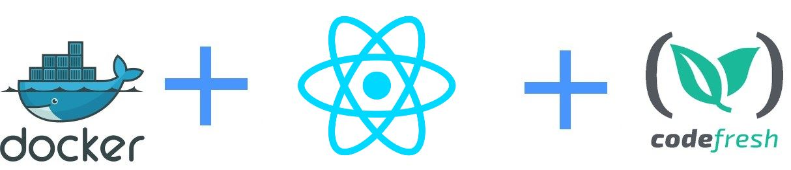

# Dockerized ReactJS application



This is an example Node application that uses React, Yarn and Docker.
It is packaged using Codefresh.

More details can be found in [the documentation page](https://codefresh.io/docs/docs/learn-by-example/nodejs/react/).


## Instructions

To install dependencies 

```
yarn install 
```

or

```
npm install 
```

## To run tests

```
yarn test 
```

or

```
npm test 
```

## To run the webapp manually

```
yarn start 
```

or

```
npm start 
```

....and navigate your browser to  http://localhost:3000/

## To create a docker image

```
docker build -t my-react-app .
```


## To run the docker image

```
docker run -p 80:80 my-react-app
```


## To use this project in Codefresh 

There is also a [codefresh.yml](codefresh.yml) for easy usage with the [Codefresh](codefresh.io) CI/CD platform.


Enjoy!


